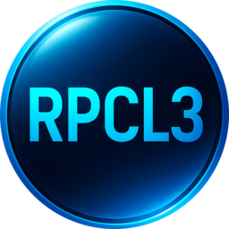

# rpcl3-db

Database (SQ-Lite) which contains probably all PS3 games, used in RPCL3.              

Use DB Browser to CRUD the database: [DB Browser](https://sqlitebrowser.org/)                       

   

---

            
**[RobertoTorino](https://github.com/RobertoTorino)**           
